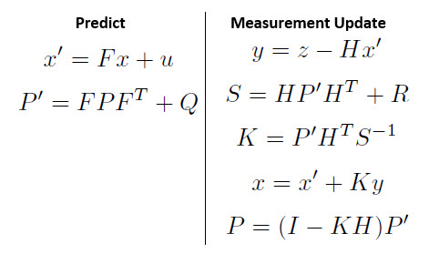
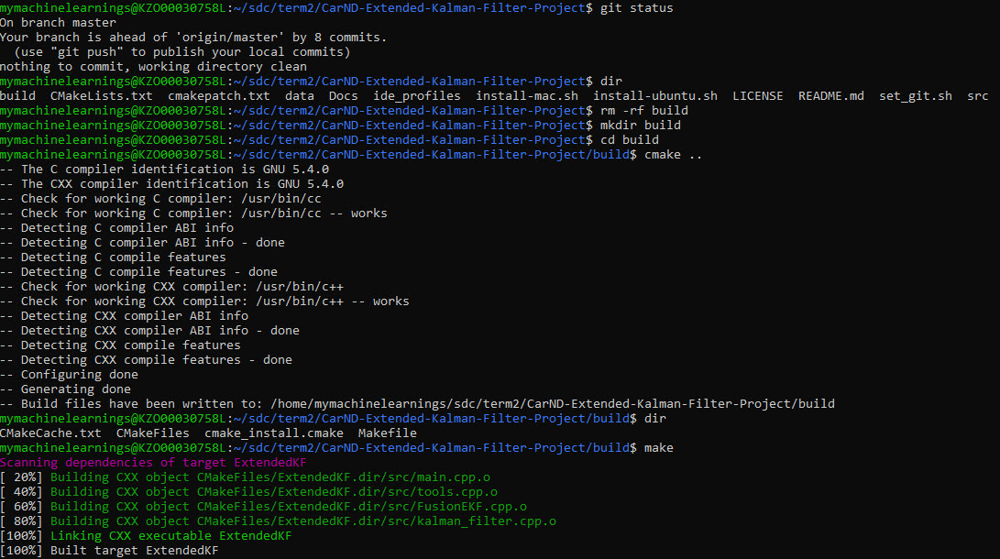

### Term 2 Project 1 : Sensor Fusion with Extended Kalman Filters
#### Project Writeup

##### Project Summary
In this project you will utilize a kalman filter to estimate the state of a moving object of interest with noisy lidar and radar measurements. Passing the project requires obtaining RMSE values that are lower than the tolerance outlined in the project rubric. 

This project involves the Term 2 Simulator which can be downloaded [here](https://github.com/udacity/self-driving-car-sim/releases)

This repository includes two files that can be used to set up and install [uWebSocketIO](https://github.com/uWebSockets/uWebSockets) for either Linux or Mac systems. For windows you can use either Docker, VMware, or even [Windows 10 Bash on Ubuntu](https://www.howtogeek.com/249966/how-to-install-and-use-the-linux-bash-shell-on-windows-10/) to install uWebSocketIO. Please see [this concept in the classroom](https://classroom.udacity.com/nanodegrees/nd013/parts/40f38239-66b6-46ec-ae68-03afd8a601c8/modules/0949fca6-b379-42af-a919-ee50aa304e6a/lessons/f758c44c-5e40-4e01-93b5-1a82aa4e044f/concepts/16cf4a78-4fc7-49e1-8621-3450ca938b77) for the required version and installation scripts.

Once the install for uWebSocketIO is complete, the main program can be built and run by doing the following from the project top directory.

1. mkdir build
2. cd build
3. cmake ..
4. make
5. ./ExtendedKF

Tips for setting up your environment can be found [here](https://classroom.udacity.com/nanodegrees/nd013/parts/40f38239-66b6-46ec-ae68-03afd8a601c8/modules/0949fca6-b379-42af-a919-ee50aa304e6a/lessons/f758c44c-5e40-4e01-93b5-1a82aa4e044f/concepts/23d376c7-0195-4276-bdf0-e02f1f3c665d)

##### Kalman Filter
    Kalman filters are used when you cannot measure something directly, but you have indirect measurements available.
    The intuition behind kalman filters is that it continuously corrects itself by making a prediction and correcting its belief using the measurements received from various sensors.

##### Kalman FIlter Equations
Kalman filter follows an end-less loop of PREDICTION-MEASUREMENT UPDATE functions

##### Extended Kalman Filters

Kalman filters assume the predictions and associated noise parameters to be described as a Gaussian function. When these become non-linear, such as in the case of RADAR measurements, a flavour of Kalman filters called Extended Kalman Filters can be used.

    The basic intuition between the two filters is the same, only difference is that the EKF will approximate the measurement function which is non-linear by a linear function that is tangent to the measurement function at its mean. This approximates the non-linear behaviour of the measurement function as linear, and hence standard Kalman Filter equations could be applied.
    
##### Variables for Extended Kalman Filters

---
### Files Submitted & Code Quality

#### 1. Submission includes all required files and can be used to run the simulator in autonomous mode

My project includes the following files:

|File Name        |Purpose                                                                                       |
|:----------------|----------------------------------------------------------------------------------------------|
|main.cpp         |communicates with the Term 2 Simulator receiving data measurements, calls a function to run the Kalman filter, calls a function to calculate RMSE                                                                       |
|FusionEKF.cpp    |initializes the filter, calls the predict function, calls the update function                 | 
|kalman_filter.cpp|defines the predict function, the update function for lidar, and the update function for radar|
|tools.cpp        |function to calculate RMSE and the Jacobian matrix                                            |
|writeup_EKF.md|Contains project writeup                                                                         |   

---
#### Rubric Points
Here I will consider the [rubric points](https://review.udacity.com/#!/rubrics/748/view) individually and describe how I addressed each point in my implementation

- Compiling
Here's a screenshot of the compilation

- Accuracy
Requirement : px, py, vx, vy output coordinates must have an RMSE <= [.11, .11, 0.52, 0.52]
Result :

---    
### Conclusion
This concludes Term 2 Project 1 : Sensor Fusion with Extended Kalman Filters use case of Udacity's Self Driving Car Nanodegree Program.

